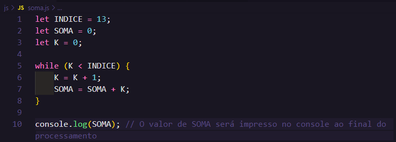
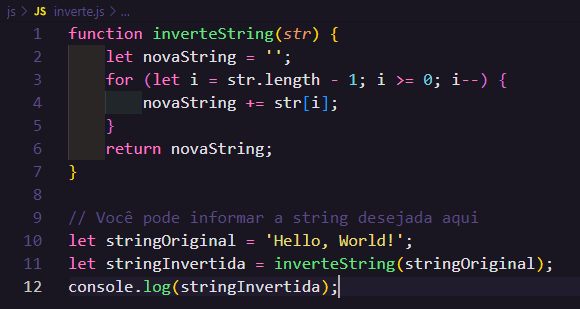

# 1 Observe o trecho de código abaixo:

int INDICE = 13, SOMA = 0, K = 0;

enquanto K < INDICE faça

{

K = K + 1;

SOMA = SOMA + K;

}

imprimir(SOMA);

Ao final do processamento, qual será o valor da variável SOMA?

## RESPOSTA:

O valor da variável SOMA será 91.

===========================================================================

# 2 Dado a sequência de Fibonacci, onde se inicia por 0 e 1 e o próximo valor sempre será a soma dos 2 valores anteriores (exemplo: 0, 1, 1, 2, 3, 5, 8, 13, 21, 34...), escreva um programa na linguagem que desejar onde, informado um número, ele calcule a sequência de Fibonacci e retorne uma mensagem avisando se o número informado pertence ou não a sequência.

IMPORTANTE:

Esse número pode ser informado através de qualquer entrada de sua preferência ou pode ser previamente definido no código;

## RESPOSTA:

===========================================================================

# 3 Descubra a lógica e complete o próximo elemento:

## RESPOSTA:

a) 1, 3, 5, 7, 9

b) 2, 4, 8, 16, 32, 64, 128

c) 0, 1, 4, 9, 16, 25, 36, 49

d) 4, 16, 36, 64, 100

e) 1, 1, 2, 3, 5, 8, 13

f) 2,10, 12, 16, 17, 18, 19, 20

===========================================================================

# 4 Você está em uma sala com três interruptores, cada um conectado a uma lâmpada em uma sala diferente. Você não pode ver as lâmpadas da sala em que está, mas pode ligar e desligar os interruptores quantas vezes quiser. Seu objetivo é descobrir qual interruptor controla qual lâmpada.

Como você faria para descobrir, usando apenas duas idas até uma das salas das lâmpadas, qual interruptor controla cada lâmpada?

## RESPOSTA:

Ligar o primeiro interruptor e esperar alguns minutos.
Em seguida, desligaria o primeiro interruptor e ligaria o segundo interruptor.
Por fim, entraria na sala. A lâmpada acesa corresponderá ao segundo interruptor, a lâmpada desligada e quente ao primeiro interruptor e a lâmpada desligada e fria ao terceiro interruptor.

===========================================================================
 

# 5 Escreva um programa que inverta os caracteres de um string.

IMPORTANTE:

a) Essa string pode ser informada através de qualquer entrada de sua preferência ou pode ser previamente definida no código;

b) Evite usar funções prontas, como, por exemplo, reverse;

## RESPOSTA:

